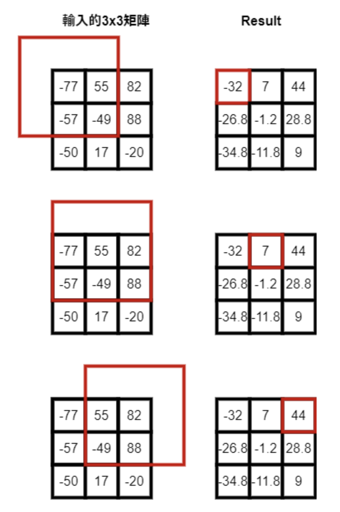

# 平均池化

<div data-step="14" data-intro="<p>描述中 <i class='fa fa-clipboard'></i> 按鈕可協助你複製到剪貼簿，並貼到本機實驗。</p> <p>若題目有特殊的字元格式，那在範例輸入/輸出測資不適用複製貼上，請務必小心</p>">

## 介紹

平均池化 (Average Pooling) 是在一個 **NxM** 的二維陣列中，給定固定大小 **PxQ** 範圍，計算該範圍內數值的平均。當 **P ≤ N** 且 **Q ≤ M** 時，進行該操作。

如下圖所示：



上圖展示了在 3x3 的陣列中，如何對每個 3x3 範圍進行平均池化，並輸出相應結果。

### 範例

例如：
- 計算範圍：`-77, 55, -57, -49` 的平均為 **-32**
- 計算範圍：`-77, 55, 82, -57, -49, 88` 的平均為 **7**
- 計算範圍：`55, 82, -49, 88` 的平均為 **44**

因此，右側結果的第一行（row）依次為 **-32, 7, 44**。

## 計算要求

### 輸入格式

輸入包含 **n+1** 行：
1. 第一行包含兩個整數 **N** 和 **M**，分別代表陣列的行數和列數，最大值為 100。
2. 接下來的 **N** 行包含 **M** 個 **double** 格式的浮點數，表示陣列中的數據。

### 輸出格式

輸出為 **N** 行，每行 **M** 個以空白分隔的浮點數，數值精確到小數點後 **3** 位，且最後一個浮點數後不應有空白。

### 提示

- 計算過程中，必須根據 **PxQ** 範圍內數字的數量來計算平均值。
- 若已完成 [40422 電力維修(一)](http://140.135.65.53:8800/problem/0/40422) 或 [40423 電力維修(二)](http://140.135.65.53:8800/problem/0/40423)，可以參考這些題目的程式碼進行修改。

## 範例

### 輸入範例

```plaintext
3 3
-0.520000 -0.640000 -0.510000
0.660000 0.580000 -0.900000
0.710000 -0.880000 -0.590000
```
這是一個 3x3 的矩陣輸入範例。

### 輸出範例
對應的平均池化輸出為：
```
0.020 -0.222 -0.367
-0.015 -0.232 -0.490
0.267 -0.070 -0.448
```
